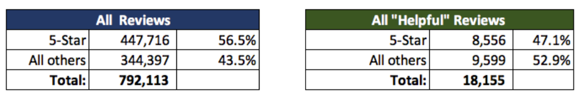
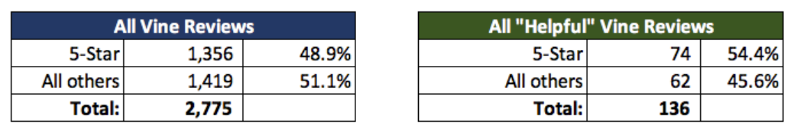
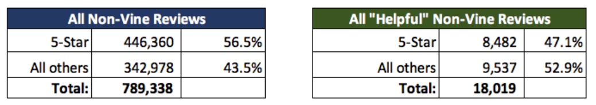
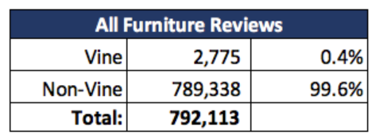
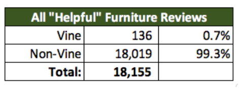
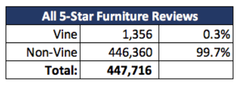
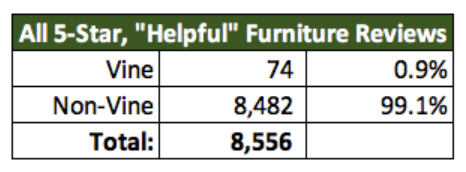

# Amazon_Vine_Analysis

## Table of Contents

- [Overview of Project](#overview-of-project)
- [Results](#results)
- [Summary](#summary)
- [Recomendations](#recomendations)

### Overview of Project
Since your work with Jennifer on the SellBy project was so fruitful, you've been entrusted with another, bigger task: breaking down Amazon surveys composed by individuals from the paid Amazon Vine program. The Amazon Vine program is a help that permits makers and distributers to get surveys for their items. Organizations like SellBy pay a little expense to Amazon and give items to Amazon Vine individuals, who are then needed to distribute a survey. 

In this undertaking, you'll approach roughly 50 datasets. Every one contains surveys of a particular item, from attire clothing to remote items. You'll have to pick one of these datasets and use PySpark to play out the ETL cycle to extricate the dataset, change the information, associate with an AWS RDS occasion, and burden the changed information into pgAdmin. Then, you'll use PySpark, Pandas, or SQL to decide whether there is any inclination toward positive surveys from Vine individuals in your dataset. Then, at that point, you'll compose a rundown of the examination for Jennifer to submit to the SellBy partners.

### Results

**Helpful Reviews (All) with 5 Star:**
For all reviews and "helpful" reviews, around half of the ratings are 5 Star, which indicates that the Vine programs tend to give 5 Stars over any other rating.

**Percentage of Vine Reviews are 5-star:**
For all the Vine Reviews, we found almost the same, a little more lower ratings than 5 Star.

**Percentage of Non-Vine Reviews are 5-star:**
In General, the non-Vine reviews is higher of 5 Stars on non-Vine reviews than 5 Star Vine.

**Vine Review vs. Non-Vine Review:**
For the entire Furniture product review file, the majority has a small Amazon Vine review

Now, applying the same analysis over smaller dataset, with "helpful" reviews, we found an average percentage from the Vine program

**5 Star Reviews Vine vs Non-Vine:**
For the entire review dataset, we found a small 5 Star reviews from Vine reviews, around 0.3%

By Filtering the "helpful" reviews only, we saw and found a light difference; a lower 1% of the 5 Star review from Vine.

> There is negligiable contrast between the normal evaluations of plant and non-plant surveys. Consequently, it tends to be reasoned that the plant audits are not one-sided and can be trusted.

### Summary

- Most of audits for Furniture item are barely anything or lower results from Vine members: 99.6% are Non-Vine. 

- Generally of every one of the 5 Star surveys are additionally equivalent to the Furniture, all are from Vine members: 99.7% of each of the 5-star audits are non-Vine. 

- We need to feature that not all of the 5 Star audits are coming from Vine members.

### Recomendations

- We tracked down that amount information isn't Vine surveys over explicit items, that we could limit the resluts and make an alternate dataset on Vine items.

- Also,the Amazon Vine Analysis give an ideal dataset on the 5-star rating. 

